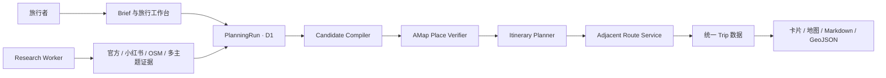

# AI Travel Planner

一个“先研究，再核验，最后规划真实道路”的旅行规划平台。

[在线产品](https://qingtian-ai-travel.amandeepchenisekyana.chatgpt.site) · [青田参考案例](https://qingtian-ai-travel.amandeepchenisekyana.chatgpt.site/cases/qingtian) · [产品作品集](https://qingtian-ai-travel.amandeepchenisekyana.chatgpt.site/case-study)

青田三日只是仓库中的第一条真实案例。平台本身面向任意目的地：用户提交旅行需求后，多来源研究先建立候选，再由高德核验最终地点和相邻道路，最后生成可交互的行程卡片与地图。

## 产品 Flow

```text
官方文旅资料 / 小红书 / OSM / 历史·文化·风景·美食研究
                              ↓
                   生成名称级候选池
                       高德调用：0
                              ↓
                别名合并、去重、证据评分
                    缩小到 20–40 个
                              ↓
              高德只核验最终候选的名称与位置
                              ↓
                 AI 每天选择 4–6 个地点
                              ↓
             只为同一天相邻地点计算真实道路
                              ↓
       同一份行程数据驱动卡片、高德 JSAPI 与导出
```

这条边界解决三个实际问题：

- 研究内容不会直接冒充真实 POI，地点必须经过实体与行政区匹配。
- 候选池不计算路线，高德费用只发生在最后的少量地点上。
- 推荐原因、地点位置和道路结果分别保留来源与状态，失败后可以从最近阶段继续。

## 平台如何组成



- 旅行者层：ChatGPT 登录、创建任务、查看自己的历史与阶段进度。
- 执行器层：受信 Research Worker 写入真实来源证据，并按状态机推进任务。
- 地图层：Web Service Key 仅存在服务器；JSAPI 负责呈现和地图交互。
- 数据层：D1 保存 Brief、证据、候选、POI 匹配、日程、路线和运行事件。

## 一次任务如何运行

1. **进入工作台**：公开首页把目的地、天数、兴趣、`must_eat` 和 `must_visit` 带到 `/studio`。Sites 的 ChatGPT 登录流程在服务器请求中注入稳定用户 ID，匿名访客不能创建任务。
2. **创建 PlanningRun**：`POST /api/trips` 规范化输入，把候选范围锁在 20–40、每日地点锁在 4–6，并把 Brief、用户归属和第一条运行事件写入 D1。浏览器只得到任务 ID。
3. **Research Worker 接管**：受信执行器读取 `brief` 任务，按历史、文化、风景、美食拆分研究线；官方页面负责事实，小红书负责体验与现场摩擦，OSM 补名称和地理线索。结果通过 `/api/planning-runs/research` 分批写入，每条证据带来源，仍不包含高德 ID。
4. **编译候选**：`/compile` 对证据执行名称归一化、传递式别名合并、跨来源去重和评分。`must_visit` 只能提升已有证据候选，`must_eat` 只能增加内容匹配分；两者都不能直接制造坐标。
5. **核验 POI**：`/verify` 每批最多向高德 POI 2.0 查询 5 个 shortlist 名称。只有行政区、名称、类型与置信度满足阈值时自动确认；同名或跨城结果进入 `needs_confirmation`。
6. **生成日程**：`/schedule` 只读取 `verified` 地点，按地理聚类、研究分数和用户硬约束选择每天 4–6 个。粗排使用坐标距离，不把直线距离展示成真实通勤时间。
7. **计算道路**：`/routes` 只建立同一天相邻 Assignment 的 RouteSegment，再按每批最多 5 段请求高德路径规划 2.0。一天 N 个地点只产生 N−1 段请求。
8. **发布结果**：`/trip` 把 POI、Day、Assignment、RouteSegment、来源与质量警告组装为统一 Trip 数据。Planner 使用它渲染卡片、候选点、道路/遥感地图和导航入口。
9. **持续反馈**：工作台轮询当前用户的任务状态和事件。刷新或重新登录后从 D1 恢复，不依赖浏览器内存保存业务结果。

当前第 3 步的自动 Research Worker 尚未部署；其余阶段已有可执行服务。任务因此会停在 `brief`，直到受信执行器写入真实证据。

### 失败与重试

- 研究证据 ID 由运行、主题、标准名称和来源摘要生成，重复写入会更新而不是堆积。
- 状态机禁止跳级和回退；成功阶段不会因为后续失败重新执行。
- POI 与路线服务跳过已经完成的对象；密钥、配额、频率和网络错误会停止当前小批次。
- 路线无法取得时只保留端点连线，并标记 `fallback_straight_line`；距离与耗时保持为空。
- 每次转换都记录事件、错误和实际供应商调用数，工作台展示的是持久化事实而不是前端动画。

## 七阶段状态机

| 阶段 | 主要工作 | 高德调用 | 持久化结果 |
|---|---|---:|---|
| `brief` | 目的地、天数、兴趣、特别想吃、必去地点 | 0 | Brief |
| `researching` | 官方、小红书、OSM 与多主题研究 | 0 | ResearchEvidence |
| `shortlisted` | 合并别名、去重评分、保留 20–40 个 | 0 | Candidate |
| `verifying` | 核验最终候选，处理同名与跨城歧义 | ≤ shortlist 数量 | ProviderMatch |
| `scheduled` | 从已核验地点中选择每天 4–6 个 | 0 | Day / Assignment |
| `routing` | 只计算同一天相邻地点 | 每天 N−1 | RouteSegment |
| `published` | 组装统一行程并提供产品视图 | 0 | Trip / Cards / Map |

状态只能向前推进。POI 与路线按每批最多 5 个执行；密钥、频率或配额错误会停止当前批次，已经完成的结果不会在重试时重复消费额度。

## 当前可以使用什么

| 产品能力 | 状态 |
|---|---|
| 公开产品入口与旅行 Brief | 已完成 |
| ChatGPT 登录和个人 PlanningRun | 已完成 |
| 七阶段进度、运行事件和实际调用量 | 已完成 |
| 研究证据写入与 20–40 候选编译 | 已完成 |
| 高德 POI 2.0 核验与人工消歧接口 | 已完成 |
| 每天 4–6 点编排与相邻道路服务 | 已完成 |
| 统一 Trip 数据、卡片地图与青田案例 | 已完成 |
| 自动 Research Worker | 下一阶段 |
| 动态任务的完整卡片地图结果页 | Research Worker 接通后收口 |

新建任务目前会停在 `brief` 并显示“等待 Research Worker”。这是刻意的产品状态：在真实研究服务尚未执行前，平台不会伪造来源、候选、坐标或路线。

## 运行依赖

### 外部服务

| 依赖 | 负责什么 | 是否必需 | 当前状态 |
|---|---|---|---|
| OpenAI Sites / ChatGPT 登录 | 托管 Worker、静态资源、登录跳转与用户身份头 | 线上工作台必需 | 已接入 |
| Cloudflare D1 | 保存用户任务和七阶段业务对象 | 动态任务必需 | 已接入，绑定名 `DB` |
| 高德 JSAPI 2.0 | 地图、Marker、道路/遥感图层与交互 | 地图视图必需 | 已接入 |
| 高德 JSAPI 安全代理 | 由 Worker 在 `/_AMapService/*` 代理并追加 `securityJsCode` | 生产 JSAPI 必需 | 已接入 |
| 高德 Web Service API 2.0 | 最终 POI 核验与相邻路径规划 | 完成真实行程必需 | 已接入 |
| 官方文旅与场馆页面 | 开放规则、历史与事实来源 | Research Worker 必需 | 接口可写入，自动采集待接入 |
| 小红书 / OpenCLI Browser Bridge | 体验、店铺和现场摩擦发现 | 中国目的地研究的重要来源 | 自动 Worker 待接入 |
| OpenStreetMap | 名称、区域与开放地理线索 | 默认研究来源 | 自动 Worker 待接入 |
| AI 模型与工具执行环境 | 汇总多主题证据、解释推荐并驱动 Worker | 自动研究必需 | 部署方案待接入 |

平台不会使用高德承担“全网发现”。即使 Research Worker 暂时不可用，也只会停留在可恢复状态，不会退回到高德批量扫城。

### 代码与构建依赖

| 组件 | 作用 |
|---|---|
| React 19 + Next.js 16 API | 页面、Client Component 与路由接口 |
| Vinext + Vite 8 | 把 App Router 构建成 Cloudflare Worker 兼容产物 |
| Drizzle ORM / Drizzle Kit | D1 查询、Schema 与增量迁移 |
| Cloudflare Vite Plugin / Wrangler | 本地 Worker、D1 绑定与兼容性环境 |
| Node.js 22.13+ | 开发、构建、测试与发布打包 |
| Python 3 | 离线管线与 Skill 脚本，不是线上请求的运行依赖 |

在线排程目前使用可测试的约束算法完成，不依赖浏览器调用大模型。AI 主要进入 Research Worker 的证据理解、主题汇总和推荐解释环节；真实 POI、坐标和道路始终由供应商结果约束。

## Skill 与分 Agent 研究

### Skill 在系统中的位置

`ai-travel-planner` 是 Research Worker 的执行规范，不是浏览器里的 JavaScript 依赖。网站负责保存任务和展示状态；真正的 Worker 必须运行在能够调用 Codex Skill、浏览器检索工具和平台 API 的受信 Agent 环境中。

```text
网站 /studio
  -> 保存 Brief 与 PlanningRun
  -> Research Worker 领取任务
      -> ai-travel-planner 规范整个阶段顺序
      -> vibe-web-research 搜索多平台
      -> history / culture / scenery / food Agents 并行研究
      -> 主 Agent 合并证据并写入 /research
      -> 主执行器依次调用 compile / verify / schedule / routes
  -> 网站轮询 D1 并展示进度与最终行程
```

网站本身不会直接“调用本机 Skill”。Skill 需要部署到 Research Worker 所在的 Agent 运行环境，再由 Worker 使用服务器令牌把结构化结果写回平台。

### 分 Agent 派发逻辑

两天以上、至少三个主题或需要深度功课时，默认并行派发四条研究线：

| Agent | 研究范围 | 必须产出 |
|---|---|---|
| `history` | 年代、迁移、人物与历史地点 | `research/01-history.md` + 结构化证据 |
| `culture` | 非遗、博物馆、手艺、社区与仪式 | `research/02-culture.md` + 结构化证据 |
| `scenery` | 城市景观、自然、季节、安全与可达性 | `research/03-scenery.md` + 结构化证据 |
| `food` | 地方菜、餐厅、咖啡馆与饮食习惯 | `research/04-food.md` + 结构化证据 |

所有研究 Agent 接收同一份规范化 Brief，但每个 Agent 只负责一条研究线：

1. 使用 `vibe-web-research` 的只读搜索模式发现来源。
2. 官方政府、文旅、场馆和运营方页面优先核对事实。
3. 小红书、抖音等平台用于发现真实体验、店铺和现场摩擦，不替代官方开放规则。
4. 输出推荐原因、现场看点、建议停留、风险与来源，不填写高德 ID、坐标或路线。
5. 主 Agent 等所有研究线完成后统一合并别名、去重和排序；不会把四份文档直接拼接成行程。

高德调用不下放给研究子 Agent。POI 核验与道路请求由一个主执行器串行控制小批次，确保 QPS、重试、缓存、消歧和调用计数一致。

### 依赖的 Skill

| Skill | 角色 | 是否必需 |
|---|---|---|
| `ai-travel-planner` | 主编排 Skill，规定 Brief、研究、候选、核验、排程、路线与输出契约 | 必需 |
| `vibe-web-research` | 官方网页、GitHub、X、小红书、抖音、头条与补充平台的只读发现和取回 | Research Worker 必需 |
| `content-analysis` | 对已经取得的文章、视频或长内容做结构化理解 | 按来源需要 |
| `imagegen` | 生成作品集封面或社交分享图，不参与 POI 和路线事实 | 可选 |
| `ljg-card` | 把最终 `trip.json` / 摘要铸成便携 PNG 卡片 | 可选 |

平台代码不应隐式依赖所有可选 Skill。Research Worker 在启动时检查所需 Skill 和连接器；缺少平台登录或检索能力时记录覆盖不完整，而不是绕过登录、验证码或来源限制。

### Skill 为什么放在仓库里

需要。仓库中的 [`skill/ai-travel-planner`](skill/ai-travel-planner) 是可审查、可版本化的事实源，必须与平台状态机和数据契约一起提交：

- `SKILL.md`：触发条件、核心原则与完整执行顺序。
- `references/`：数据契约、高德接入、卡片地图、分 Agent 研究、TREK 模式和平台边界。
- `scripts/`：高德配置、MCP/REST 连接、候选编译、排程、验证与静态渲染。
- `assets/`：最小示例数据。

本机 `C:\Users\<user>\.codex\skills\ai-travel-planner` 是开发时安装副本，不应成为唯一来源。每次修改先更新仓库版本、运行 Skill 校验并提交 GitHub，再同步安装副本。部署 Research Worker 时也应从仓库的固定提交安装，而不是依赖某台电脑上的临时文件。

## 页面入口

- `/`：公开产品首页和 Brief 输入。
- `/studio`：登录后的旅行研究工作台，可创建、恢复和查看自己的任务。
- `/cases/qingtian`：青田三日参考案例，不参与通用平台逻辑。
- `/case-study`：面向作品集的产品介绍。
- `/summary`：青田案例的可阅读行程摘要。

## 服务接口

旅行者接口使用 ChatGPT 登录身份，并校验 `owner_user_id`：

- `GET /api/trips`：当前用户的 PlanningRun 列表。
- `POST /api/trips`：创建属于当前用户的 PlanningRun。
- `GET /api/trips?run_id=...`：读取阶段、统计与运行事件。
- `GET /api/trips/trip?run_id=...`：读取当前用户已发布任务的统一行程数据。

Research Worker 与受信执行器接口使用服务器令牌：

- `/api/planning-runs`：管理运行与合法阶段转换。
- `/api/planning-runs/research`：幂等写入真实研究证据，高德调用固定为 0。
- `/api/planning-runs/compile`：编译名称级候选池。
- `/api/planning-runs/candidates`：读取候选、来源、风险和用户需求匹配。
- `/api/planning-runs/verify`：小批量核验高德 POI，并确认或拒绝歧义结果。
- `/api/planning-runs/schedule`：只从已核验地点生成每天 4–6 个安排。
- `/api/planning-runs/routes`：只创建和计算相邻 RouteSegment。
- `/api/planning-runs/trip`：组装卡片和地图共用的 Trip 数据。

字段契约、离线命令与阶段限制见 [platform/README.md](platform/README.md)。

## 本地开发

要求 Node.js 22.13+；离线管线测试还需要 Python 3。

```bash
npm install
npm run dev
```

复制 `.env.example` 后按需要配置：

| 变量 | 使用位置 | 是否敏感 |
|---|---|---|
| `AMAP_JSAPI_KEY` | 浏览器加载高德地图 | 否，但要配置域名白名单 |
| `AMAP_SECURITY_JS_CODE` | JSAPI 安全代理 | 是 |
| `AMAP_WEBSERVICE_KEY` | 服务器 POI 2.0 与路径规划 2.0 | 是 |
| `PLANNING_RUN_WRITE_TOKEN` | Research Worker / 执行器接口 | 是 |

生产环境变量由 Sites 管理，不写入 Git。`AMAP_WEBSERVICE_KEY` 与浏览器 JSAPI Key 是两类不同的高德 Key。

## 验证

```bash
npm run lint
npm run typecheck
npm test
npm audit --omit=dev
```

测试覆盖 Brief 约束、候选去重、POI 匹配与消歧、每天 4–6 点编排、相邻路线数量、路线降级状态、登录跳转、用户归属边界和服务端渲染。

## 仓库结构

```text
app/                    产品页面、工作台与 API
cases/qingtian/         青田参考案例数据
db/ + drizzle/          D1 模型与迁移
platform/runtime/       Brief、研究、POI 和排程纯逻辑
platform/server/        高德适配器与运行时安全边界
platform/pipeline.py    可复现的离线候选与排程管线
skill/ai-travel-planner 可复用 Codex Skill 源码
tests/                  产品边界与运行时测试
```

## 青田参考案例

青田案例验证了平台的产品呈现，而不是把平台写死为一个城市：

- 3 天，美食为重点，同时覆盖历史、文化和风景。
- 21 个高德已核验 POI，另有待消歧候选。
- 15 段同日相邻真实道路。
- 支持道路/遥感图层、研究区复位、候选点上图、卡片与地图互相定位、简介展开、插入、移除和重排。

## 设计参考

项目主要参考 [liketrek/TREK](https://github.com/liketrek/TREK) 的结构化旅行建模思路，并重新实现为本仓库的 Brief → Evidence → Candidate → ProviderMatch → Assignment → RouteSegment 状态管线。TREK 只作为架构学习材料；本项目不复制其 AGPL-3.0 源码。

## 下一步

1. 接入可租约、可重试的 Research Worker，实际执行官方文旅、小红书、OSM 与多主题检索。
2. 为需要人工处理的同名 POI 增加消歧页面。
3. 将已发布动态任务直接渲染为现有 Planner 卡片地图，而不只返回 JSON。
4. 增加按用户的任务数、POI 调用和路线调用配额。

阶段记录见 [CHANGELOG.md](CHANGELOG.md)，研发与发布规则见 [AGENTS.md](AGENTS.md)。
