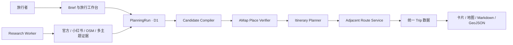

# AI Travel Planner

一个“先研究，再核验，最后规划真实道路”的旅行规划平台。

[在线产品](https://qingtian-ai-travel.amandeepchenisekyana.chatgpt.site) · [青田参考案例](https://qingtian-ai-travel.amandeepchenisekyana.chatgpt.site/cases/qingtian) · [产品作品集](https://qingtian-ai-travel.amandeepchenisekyana.chatgpt.site/case-study)

青田三日只是仓库中的第一条真实案例。平台本身面向任意目的地：用户提交旅行需求后，多来源研究先建立候选，再由高德核验最终地点和相邻道路，最后生成可交互的行程卡片与地图。

## 产品 Flow

```text
官方文旅资料 / 小红书 / OSM / 用户自选多主题研究
                              ↓
                   生成名称级候选池
                       高德调用：0
                              ↓
                别名合并、去重、证据评分
                    缩小到 20–40 个
                              ↓
              高德只核验最终候选的名称与位置
                              ↓
                 AI 每天选择 4–6 个地点
                              ↓
             只为同一天相邻地点计算真实道路
                              ↓
       同一份行程数据驱动卡片、高德 JSAPI 与导出
```

这条边界解决三个实际问题：

- 研究内容不会直接冒充真实 POI，地点必须经过实体与行政区匹配。
- 候选池不计算路线，高德费用只发生在最后的少量地点上。
- 推荐原因、地点位置和道路结果分别保留来源与状态，失败后可以从最近阶段继续。

## 平台如何组成



- 旅行者层：ChatGPT 登录、创建任务、查看自己的历史与阶段进度。
- 执行器层：受信 Research Worker 写入真实来源证据，并按状态机推进任务。
- 地图层：Web Service Key 仅存在服务器；JSAPI 负责呈现和地图交互。
- 数据层：D1 保存 Brief、证据、候选、POI 匹配、日程、路线和运行事件。

## 一次任务如何运行

1. **进入工作台**：公开首页把目的地、天数、兴趣、`must_eat` 和 `must_visit` 带到 `/studio`。Sites 的 ChatGPT 登录流程在服务器请求中注入稳定用户 ID，匿名访客不能创建任务。
2. **创建 PlanningRun**：`POST /api/trips` 规范化输入，把候选范围锁在 20–40、每日地点锁在 4–6，并把 Brief、用户归属和第一条运行事件写入 D1。浏览器只得到任务 ID。
3. **Research Worker 接管**：受信执行器读取 `brief` 任务，按用户从 38 项目录中选择的主题动态拆分研究线；历史、文化、风景、美食只是默认组合。目录按“人文与城市、自然与户外、吃喝与生活、兴趣与娱乐、旅行方式”分类，目录外要求进入自定义研究线。官方页面负责事实，小红书负责体验与现场摩擦，OSM 补名称和地理线索。结果通过 `/api/planning-runs/research` 分批写入，每条证据带来源，仍不包含高德 ID。
4. **编译候选**：`/compile` 对证据执行名称归一化、传递式别名合并、跨来源去重和评分。`must_visit` 只能提升已有证据候选，`must_eat` 只能增加内容匹配分；两者都不能直接制造坐标。
5. **核验 POI**：`/verify` 每批最多向高德 POI 2.0 查询 5 个 shortlist 名称。只有行政区、名称、类型与置信度满足阈值时自动确认；同名或跨城结果进入 `needs_confirmation`。
6. **生成日程**：`/schedule` 只读取 `verified` 地点，按地理聚类、研究分数和用户硬约束选择每天 4–6 个。粗排使用坐标距离，不把直线距离展示成真实通勤时间。
7. **计算道路**：`/routes` 只建立同一天相邻 Assignment 的 RouteSegment，再按每批最多 5 段请求高德路径规划 2.0。一天 N 个地点只产生 N−1 段请求。
8. **发布结果**：`/trip?run_id=...` 在服务端校验任务归属，把 POI、Day、Assignment、RouteSegment、来源与质量警告组装为统一 Trip 数据。Planner 使用它渲染卡片、候选点、道路/遥感地图、导航入口与 Markdown/GeoJSON 导出。
9. **持续编辑**：用户插入、移除或重排地点后，修改写回 D1；系统保留未变化地点的 Assignment ID 和未变化的相邻 RouteSegment，只使断开的相邻点对失效，再由 Worker 计算新增点对。例如在 A→B→C 中插入 X，只需新增 A→X、X→B，B→C 的真实道路继续复用。
10. **持续反馈**：工作台轮询当前用户的任务状态和事件。刷新或重新登录后从 D1 恢复，不依赖浏览器内存保存业务结果。
11. **控制用量**：网站按登录用户统计进行中任务、本月任务和真实高德 POI/路线调用；额度耗尽时任务进入 `awaiting_quota`，下月由 Worker 自动恢复，已完成结果不重复请求。
12. **分享成品**：已发布行程可以生成只读链接。链接只包含卡片与地图，不带任务历史、编辑、导出或用户身份；所有者可设置 7/30/90 天或长期有效，并随时撤销。

仓库已经包含可租约、可重试的 Research Worker。它根据用户选择动态创建最多 8 条主题研究线，并以最多 4 个 Codex Agent 有界并发执行；公共 Sites 仍需单独启动这个常驻进程。Worker 未在线时，任务会安全停在 `brief`，不会伪造真实证据。

### 失败与重试

- 研究证据 ID 由运行、主题、标准名称和来源摘要生成，重复写入会更新而不是堆积。
- 状态机禁止跳级和回退；成功阶段不会因为后续失败重新执行。
- POI 与路线服务跳过已经完成的对象；行程编辑也会保留未受影响的真实路段。密钥、配额、频率和网络错误会停止当前小批次。
- 路线无法取得时只保留端点连线，并标记 `fallback_straight_line`；距离与耗时保持为空。
- 每次转换都记录事件、错误和实际供应商调用数，工作台展示的是持久化事实而不是前端动画。
- 用户配额由网站后端和 D1 强制，不依赖 Prompt 自觉；`awaiting_quota` 是可恢复暂停，不计入 Worker 失败重试。

## 七阶段状态机

| 阶段 | 主要工作 | 高德调用 | 持久化结果 |
|---|---|---:|---|
| `brief` | 目的地、天数、兴趣、特别想吃、必去地点 | 0 | Brief |
| `researching` | 官方、小红书、OSM 与多主题研究 | 0 | ResearchEvidence |
| `shortlisted` | 合并别名、去重评分、保留 20–40 个 | 0 | Candidate |
| `verifying` | 核验最终候选，处理同名与跨城歧义 | ≤ shortlist 数量 | ProviderMatch |
| `scheduled` | 从已核验地点中选择每天 4–6 个 | 0 | Day / Assignment |
| `routing` | 只计算同一天相邻地点 | 每天 N−1 | RouteSegment |
| `published` | 组装统一行程并提供产品视图 | 0 | Trip / Cards / Map |

状态只能向前推进。POI 与路线按每批最多 5 个执行；密钥、频率或配额错误会停止当前批次，已经完成的结果不会在重试时重复消费额度。

## 当前可以使用什么

| 产品能力 | 状态 |
|---|---|
| 公开产品入口与旅行 Brief | 已完成 |
| ChatGPT 登录和个人 PlanningRun | 已完成 |
| 七阶段进度、运行事件和实际调用量 | 已完成 |
| 研究证据写入与 20–40 候选编译 | 已完成 |
| 高德 POI 2.0 核验与人工消歧接口 | 已完成 |
| 登录用户同名/跨城 POI 消歧页面 | 已完成 |
| 每天 4–6 点编排与相邻道路服务 | 已完成 |
| 统一 Trip 数据、卡片地图与青田案例 | 已完成 |
| Worker 租约、动态主题状态与失败重试 | 已完成 |
| Codex 多主题有界并发检索执行器 | 已完成，公共环境待常驻部署 |
| 动态任务的身份隔离卡片地图结果页 | 已完成 |
| 动态行程插入、移除、重排与受影响路段增量重算 | 已完成，公共环境待 Worker 常驻 |
| 用户专属 Markdown / GeoJSON 导出 | 已完成 |
| 逐用户任务数与高德月度调用配额 | 已完成 |
| 可过期、可撤销的只读旅行分享 | 已完成 |

新建任务先进入 `brief` 队列；在线 Worker 领取后进入 `researching`，工作台会显示每条研究线的等待、检索、完成或待重试状态。公共环境尚未启动 Worker 时会继续显示等待，这是可恢复的真实状态。

## 运行依赖

### 外部服务

| 依赖 | 负责什么 | 是否必需 | 当前状态 |
|---|---|---|---|
| OpenAI Sites / ChatGPT 登录 | 托管 Worker、静态资源、登录跳转与用户身份头 | 线上工作台必需 | 已接入 |
| Cloudflare D1 | 保存用户任务和七阶段业务对象 | 动态任务必需 | 已接入，绑定名 `DB` |
| 高德 JSAPI 2.0 | 地图、Marker、道路/遥感图层与交互 | 地图视图必需 | 已接入 |
| 高德 JSAPI 安全代理 | 由 Worker 在 `/_AMapService/*` 代理并追加 `securityJsCode` | 生产 JSAPI 必需 | 已接入 |
| 高德 Web Service API 2.0 | 最终 POI 核验与相邻路径规划 | 完成真实行程必需 | 已接入 |
| 官方文旅与场馆页面 | 开放规则、历史与事实来源 | Research Worker 必需 | Codex 研究线已接入 |
| 小红书 / OpenCLI Browser Bridge | 体验、店铺和现场摩擦发现 | 中国目的地研究的重要来源 | 由 `vibe-web-research` 按登录能力检索 |
| OpenStreetMap | 名称、区域与开放地理线索 | 默认研究来源 | Codex 研究线已接入 |
| Codex CLI / Agent 运行环境 | 用户所选主题检索、结构化输出和主流程驱动 | 自动研究必需 | 执行器已实现，需独立常驻部署 |

平台不会使用高德承担“全网发现”。即使 Research Worker 暂时不可用，也只会停留在可恢复状态，不会退回到高德批量扫城。

### 代码与构建依赖

| 组件 | 作用 |
|---|---|
| React 19 + Next.js 16 API | 页面、Client Component 与路由接口 |
| Vinext + Vite 8 | 把 App Router 构建成 Cloudflare Worker 兼容产物 |
| Drizzle ORM / Drizzle Kit | D1 查询、Schema 与增量迁移 |
| Cloudflare Vite Plugin / Wrangler | 本地 Worker、D1 绑定与兼容性环境 |
| Node.js 22.13+ | 开发、构建、测试与发布打包 |
| Python 3 | 离线管线与 Skill 脚本，不是线上请求的运行依赖 |

在线排程目前使用可测试的约束算法完成，不依赖浏览器调用大模型。AI 主要进入 Research Worker 的证据理解、主题汇总和推荐解释环节；真实 POI、坐标和道路始终由供应商结果约束。

## Skill 与分 Agent 研究

### Skill 在系统中的位置

`ai-travel-planner` 是 Research Worker 的执行规范，不是浏览器里的 JavaScript 依赖。网站负责保存任务、用户配额和分享权限；真正的 Worker 必须运行在能够调用 Codex Skill、浏览器检索工具和平台 API 的受信 Agent 环境中。配额不是一个新 Skill：它是网站后端的可信业务边界，Skill 只需要遵守平台返回的 `awaiting_quota` 状态。

```text
网站 /studio
  -> 保存 Brief 与 PlanningRun
  -> Research Worker 领取任务
      -> ai-travel-planner 规范整个阶段顺序
      -> vibe-web-research 搜索多平台
      -> 按用户所选主题动态派发 Agents（最多 8 条、并发 4 条）
      -> 主 Agent 合并证据并写入 /research
      -> 主执行器依次调用 compile / verify / schedule / routes
  -> 网站轮询 D1 并展示进度与最终行程
```

网站本身不会直接“调用本机 Skill”。Skill 需要部署到 Research Worker 所在的 Agent 运行环境，再由 Worker 使用服务器令牌把结构化结果写回平台。

一个阿里云 Research Worker 可以服务所有用户：它从共享队列逐个领取 PlanningRun，并只在单个任务内部按主题并行派发研究 Agent。扩容时增加同一种 Worker 实例即可，租约保证同一任务不会被重复执行；不需要为每位用户复制 Worker 或 Skill。

### 分 Agent 派发逻辑

产品提供 38 个可选旅行主题，用户可以按五类浏览并最多选择 8 个。历史遗迹、文化非遗、自然风景、地方美食只是默认推荐组合；Worker 按实际 Brief 动态创建研究任务：

| 分类 | 可选主题 |
|---|---|
| 人文与城市 | 历史遗迹、文化非遗、建筑漫步、博物馆、艺术设计、宗教信仰、文学名人、工业遗产 |
| 自然与户外 | 自然风景、徒步登山、骑行路线、露营观星、海滨海岛、亲水体验、冰雪旅行、动物生态 |
| 吃喝与生活 | 地方美食、在地生活、菜场夜市、咖啡甜品、茶酒体验、夜游娱乐、购物市集、手作体验 |
| 兴趣与娱乐 | 影视动漫、摄影打卡、演出演艺、节庆活动、体育赛事、乐园游乐、科技探索 |
| 旅行方式 | 亲子家庭、康养度假、慢旅行、自驾公路、火车旅行、无障碍友好、宠物同行 |

目录外的用户兴趣会合并为一条 `special_interest` 自定义研究线，不丢失用户原始要求。未选择任何主题时才回退到默认四项。

### 图片与案例扩展原则

- 新建任务与运行进度属于高频操作界面，优先保证信息密度和首屏可操作性，不用纯装饰插图占据表单空间。
- 当案例数量增加后，首页案例集合使用各目的地独立封面；已发布行程可以使用目的地 Hero，任务历史可使用轻量缩略图。
- 图片只表达目的地气质，不承担 POI、开放状态、坐标或路线事实；事实仍由研究证据和地图核验提供。
- 封面需要响应式裁切和延迟加载；移动端可以弱化或隐藏任务缩略图，不能挤压核心操作。

### 网站信息架构原则

- 首屏直接提供可操作 Brief，不用只有口号的展示型 Hero；用户应在理解产品的同时立即开始创建任务。
- 用紧凑能力带说明“来源发现 → 专题研究 → POI 核验 → 真实道路”，再用流程卡片解释阶段边界。
- 提升信息密度依靠清晰分组、较短间距和明确层级，不通过缩小到难以阅读的字号或堆叠装饰图实现。

所有研究 Agent 接收同一份规范化 Brief，但每个 Agent 只负责一条研究线：

1. 使用 `vibe-web-research` 的只读搜索模式发现来源。
2. 官方政府、文旅、场馆和运营方页面优先核对事实。
3. 小红书、抖音等平台用于发现真实体验、店铺和现场摩擦，不替代官方开放规则。
4. 输出推荐原因、现场看点、建议停留、风险与来源，不填写高德 ID、坐标或路线。
5. 主 Agent 等所有已选研究线完成后统一合并别名、去重和排序；不会把多份文档直接拼接成行程。

高德调用不下放给研究子 Agent。POI 核验与道路请求由一个主执行器串行控制小批次，确保 QPS、重试、缓存、消歧和调用计数一致。

### 依赖的 Skill

| Skill | 角色 | 是否必需 |
|---|---|---|
| `ai-travel-planner` | 主编排 Skill，规定 Brief、研究、候选、核验、排程、路线与输出契约 | 必需 |
| `vibe-web-research` | 官方网页、GitHub、X、小红书、抖音、头条与补充平台的只读发现和取回 | Research Worker 必需 |
| `content-analysis` | 对已经取得的文章、视频或长内容做结构化理解 | 按来源需要 |
| `imagegen` | 生成作品集封面或社交分享图，不参与 POI 和路线事实 | 可选 |
| `ljg-card` | 把最终 `trip.json` / 摘要铸成便携 PNG 卡片 | 可选 |

平台代码不应隐式依赖所有可选 Skill。Research Worker 在启动时检查所需 Skill 和连接器；缺少平台登录或检索能力时记录覆盖不完整，而不是绕过登录、验证码或来源限制。

### Skill 为什么放在仓库里

需要。仓库中的 [`.agents/skills/ai-travel-planner`](.agents/skills/ai-travel-planner) 是可审查、可版本化的事实源，必须与平台状态机和数据契约一起提交。`.agents/skills` 同时是 Codex 官方支持的仓库级自动发现位置，因此 Worker 从仓库根目录启动时可以直接加载这个 Skill：

- `SKILL.md`：触发条件、核心原则与完整执行顺序。
- `references/`：数据契约、高德接入、卡片地图、分 Agent 研究、TREK 模式和平台边界。
- `scripts/`：高德配置、MCP/REST 连接、候选编译、排程、验证与静态渲染。
- `assets/`：最小示例数据。

本机 `C:\Users\<user>\.codex\skills\ai-travel-planner` 是开发时安装副本，不应成为唯一来源。每次修改先更新仓库版本、运行 Skill 校验并提交 GitHub，再同步安装副本。部署 Research Worker 时也应从仓库的固定提交安装，而不是依赖某台电脑上的临时文件。

## 页面入口

- `/`：公开产品首页和 Brief 输入。
- `/studio`：登录后的旅行研究工作台，可创建、恢复和查看自己的任务。
- `/cases/qingtian`：青田三日参考案例，不参与通用平台逻辑。
- `/case-study`：面向作品集的产品介绍。
- `/summary`：青田案例的可阅读行程摘要。

## 服务接口

旅行者接口使用 ChatGPT 登录身份，并校验 `owner_user_id`：

- `GET /api/trips`：当前用户的 PlanningRun 列表。
- `POST /api/trips`：创建属于当前用户的 PlanningRun。
- `GET /api/trips?run_id=...`：读取阶段、统计与运行事件。
- `GET /api/trips/trip?run_id=...`：读取当前用户已发布任务的统一行程数据。
- `GET/PATCH /api/trips/disambiguation`：读取自己的同名/跨城候选并确认高德实体或排除错误地点；最后一项处理完后自动恢复任务队列。
- `PATCH /api/trips/itinerary`：持久化当天的插入、移除和顺序修改，删除失效道路并重新排队。
- `GET /api/trips/export?run_id=...&format=markdown|geojson`：导出当前用户自己的可读行程或真实地图数据。
- `GET/POST/DELETE /api/trips/shares`：列出、创建和撤销自己已发布行程的只读分享链接；数据库只保存 Token 摘要。
- `/share/:token`：匿名只读卡片地图；失效、过期或撤销后立即不可访问。

Research Worker 与受信执行器接口使用服务器令牌：

- `/api/planning-runs`：管理运行与合法阶段转换。
- `/api/planning-runs/claim`：原子领取任务、续租、记录研究线开始/完成/失败并安全释放。
- `/api/planning-runs/research`：幂等写入真实研究证据，高德调用固定为 0。
- `/api/planning-runs/compile`：编译名称级候选池。
- `/api/planning-runs/candidates`：读取候选、来源、风险和用户需求匹配。
- `/api/planning-runs/verify`：小批量核验高德 POI，并确认或拒绝歧义结果。
- `/api/planning-runs/schedule`：只从已核验地点生成每天 4–6 个安排。
- `/api/planning-runs/routes`：只创建和计算相邻 RouteSegment。
- `/api/planning-runs/trip`：组装卡片和地图共用的 Trip 数据。

字段契约、离线命令与阶段限制见 [platform/README.md](platform/README.md)。

## 本地开发

要求 Node.js 22.13+；离线管线测试还需要 Python 3。

```bash
npm install
npm run dev
```

复制 `.env.example` 后按需要配置：

| 变量 | 使用位置 | 是否敏感 |
|---|---|---|
| `AMAP_JSAPI_KEY` | 浏览器加载高德地图 | 否，但要配置域名白名单 |
| `AMAP_SECURITY_JS_CODE` | JSAPI 安全代理 | 是 |
| `AMAP_WEBSERVICE_KEY` | 服务器 POI 2.0 与路径规划 2.0 | 是 |
| `PLANNING_RUN_WRITE_TOKEN` | Research Worker / 执行器接口 | 是 |
| `TRAVELER_ACTIVE_RUN_LIMIT` | 每位用户同时进行中的任务上限，默认 3 | 否 |
| `TRAVELER_MONTHLY_RUN_LIMIT` | 每位用户每月创建任务上限，默认 10 | 否 |
| `TRAVELER_MONTHLY_POI_LIMIT` | 每位用户每月高德 POI 调用上限，默认 200 | 否 |
| `TRAVELER_MONTHLY_ROUTE_LIMIT` | 每位用户每月高德路线调用上限，默认 200 | 否 |

生产环境变量由 Sites 管理，不写入 Git。`AMAP_WEBSERVICE_KEY` 与浏览器 JSAPI Key 是两类不同的高德 Key。

### 启动 Research Worker

Worker 与网站分开运行；详细配置见 [research-worker/README.md](research-worker/README.md)。最小启动方式：

```powershell
$env:PLANNER_BASE_URL = "https://your-site.example"
$env:PLANNING_RUN_WRITE_TOKEN = "<server-token>"
$env:CODEX_EXECUTABLE = "C:\path\to\codex.exe"
npm.cmd run worker:research -- --watch
```

Worker 使用 `codex exec --output-schema` 约束每条研究线的结果。Codex 子进程只做只读研究，且不会继承平台写入令牌或高德密钥。

仓库已经提供 2 核 2G 阿里云的低并发环境模板、systemd 服务和不领取任务的 `--check` 上线检查。ECS 只需主动访问 Sites，因此没有域名也可以运行 Worker，安全组无需为它新增 Web 端口。完整清单见 [research-worker/README.md#2-核-2g-阿里云部署](research-worker/README.md#2-核-2g-阿里云部署)。

需要特别区分两种检索覆盖：普通 headless ECS 可以稳定承担官方网页、开放 Web 与 OSM 研究；小红书等登录平台还需要服务用户可用的合法登录态或 Browser Bridge。没有这项能力时 Worker 必须记录“覆盖不足”，不能抓取绕过，也不能把未核验内容冒充来源。

## 验证

```bash
npm run lint
npm run typecheck
npm test
npm audit --omit=dev
```

测试覆盖 Brief 约束、候选去重、POI 匹配与消歧、每天 4–6 点编排、相邻路线数量、编辑后的路线差分、路线降级状态、登录跳转、用户归属边界和服务端渲染。

## 仓库结构

```text
app/                    产品页面、工作台与 API
cases/qingtian/         青田参考案例数据
db/ + drizzle/          D1 模型与迁移
platform/runtime/       Brief、研究、POI 和排程纯逻辑
platform/server/        高德适配器与运行时安全边界
platform/pipeline.py    可复现的离线候选与排程管线
.agents/skills/ai-travel-planner 仓库级 Codex Skill 源码
research-worker/        任务租约、动态主题 Codex 派发与阶段推进
tests/                  产品边界与运行时测试
```

## 青田参考案例

青田案例验证了平台的产品呈现，而不是把平台写死为一个城市：

- 3 天，美食为重点，同时覆盖历史、文化和风景。
- 21 个高德已核验 POI，另有待消歧候选。
- 15 段同日相邻真实道路。
- 支持道路/遥感图层、研究区复位、候选点上图、卡片与地图互相定位、简介展开、插入、移除和重排。

## 设计参考

项目主要参考 [liketrek/TREK](https://github.com/liketrek/TREK) 的结构化旅行建模思路，并重新实现为本仓库的 Brief → Evidence → Candidate → ProviderMatch → Assignment → RouteSegment 状态管线。TREK 只作为架构学习材料；本项目不复制其 AGPL-3.0 源码。

## 下一步

1. 在独立常驻环境部署 Research Worker，并用真实非青田目的地完成端到端运行。
2. 增加任务取消/归档和管理员级总量监控，再根据真实用量调整默认配额。
3. 根据首批真实任务补充交通偏好、跨日调整和失败路段的人工重试入口。

阶段记录见 [CHANGELOG.md](CHANGELOG.md)，研发与发布规则见 [AGENTS.md](AGENTS.md)。
